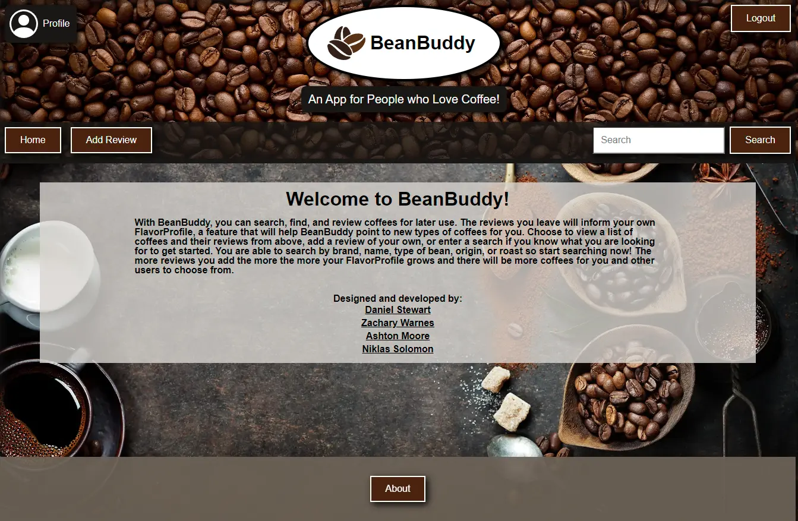

# **BeanBuddy** - 
## **Description**

With BeanBuddy, you can search, find, and review coffees for later use. The reviews you leave will inform your own FlavorProfile, a feature that will help BeanBuddy point to new types of coffees for you. Choose to view a list of coffees and their reviews from above, add a review of your own, or enter a search if you know what you are looking for to get started. You are able to search by brand, name, type of bean, origin, or roast so start searching now! The more reviews you add the more the more your FlavorProfile grows and there will be more coffees for you and other users to choose from.

## **Table of Contents**

- [Usage](#usage)
- [License](#license)
- [Technology](#technology)
- [Questions](#questions)

## **Usage**

1. Visit Site.
2. Search for coffee.
3. Build a flavor profile by leaving reviews.

### Click Preview Image or [Here](https://bean-buddy.herokuapp.com/) to visit **BeanBuddy**.

## **License**

MIT License

Copyright 2022 &copy; Daniel Stewart, Zachary Warnes, Ashton Moore, Niklas Solomon

Permission is hereby granted, free of charge, to any person obtaining a copy of this software and associated documentation files (the "Software"), to deal in the Software without restriction, including without limitation the rights to use, copy, modify, merge, publish, distribute, sublicense, and/or sell copies of the Software, and to permit persons to whom the Software is furnished to do so, subject to the following conditions:

The above copyright notice and this permission notice shall be included in all copies or substantial portions of the Software.

THE SOFTWARE IS PROVIDED "AS IS", WITHOUT WARRANTY OF ANY KIND, EXPRESS OR IMPLIED, INCLUDING BUT NOT LIMITED TO THE WARRANTIES OF MERCHANTABILITY, FITNESS FOR A PARTICULAR PURPOSE AND NONINFRINGEMENT. IN NO EVENT SHALL THE AUTHORS OR COPYRIGHT HOLDERS BE LIABLE FOR ANY CLAIM, DAMAGES OR OTHER LIABILITY, WHETHER IN AN ACTION OF CONTRACT, TORT OR OTHERWISE, ARISING FROM, OUT OF OR IN CONNECTION WITH THE SOFTWARE OR THE USE OR OTHER DEALINGS IN THE SOFTWARE.

## **Technology**

### Languages

- 
- 
- 

### Libraries

#### Runtime

- 

### Packages

#### Client

- 
- 
- 
- 

#### Server

- 
- 
- 
- 
- 
- 

### Database

- 

### Storage
- 

### Development

- 
- 
## **Questions**

If you have any questions or feedback you can contact us through one of the links below: 

### **Daniel Stewart**
GitHub Profile - [danielstewart914](https://github.com/danielstewart914) 
Email - [danielstewart914@outlook.com](mailto:danielstewart914@outlook.com)

### **Zachary Warnes**
GitHub Profile - [ZacharyWarnes](https://github.com/ZacharyWarnes) 
Email - [zacharywarnes@gmail.com](mailto:zacharywarnes@gmail.com)

### **Ashton Moore**
GitHub Profile - [azm89](https://github.com/azm89) 
Email - [ashtonmoore89@gmail.com](mailto:ashtonmoore89@gmail.com)

### **Niklas Solomon**
GitHub Profile - [NiklasSolomon](https://github.com/NiklasSolomon) 
Email - [niklassolomon@gmail.com](mailto:niklassolomon@gmail.com)